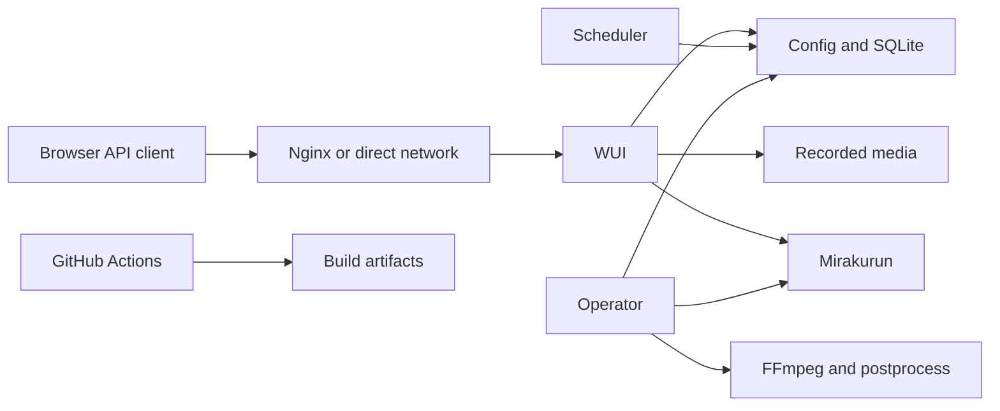

# Chinachu-Go 脅威モデル

作成日: 2026-07-28  
対象: リポジトリ全体（実行時の WUI、scheduler、operator、設定・データ保管、および CI）

## Executive summary

Strata PVR は録画・番組情報・設定を扱う Go 製 PVR であり、WUI の認証済み利用者は設定変更を通じて後処理コマンドを指定できます。最重要リスクは、同一権限の WUI 利用者または盗まれた認証情報が、operator の実行権限で任意コマンドを動かせることです。公開方法と実行 OS ユーザーが設置者に委ねられるため、直接公開、Nginx の転送ヘッダー設定、最小権限実行が全体のリスクを大きく左右します。

## Scope and assumptions

- 対象: `cmd/`、`internal/wui/`、`internal/operator/`、`internal/scheduler/`、`internal/config/`、`internal/database/`、`internal/storage/`、`internal/mirakurun/`、`web/`、`.github/workflows/ci.yml`。
- 対象外: Mirakurun、Nginx/VPN、OS・ファイルシステム権限、家庭内ネットワーク、FFmpeg 自体の実装。ただし、それらとの境界は評価対象です。
- 利用は LAN/VPN が基本だが、設置者によっては直接アクセスまたはリバースプロキシ公開される。
- 複数の認証ユーザーを登録できるが、ロール・権限分離はない。全員が管理相当である。
- 実行 OS ユーザーと公開範囲は設置者が決める。後処理コマンドは WUI で編集され、operator が実行する。
- 重要な未解決事項: 実際の Nginx 設定、OS サービスの `User=`、録画ディレクトリの所有者、Mirakurun の到達範囲、外部公開の有無。

## System model

### Primary components

- WUI: `internal/wui/server.go` が HTTP サーバーと `/api/` を提供し、`web/` を静的配信する。
- 認証: `internal/wui/auth.go` は Argon2id パスワード、メモリ内セッション、Bearer API トークンを扱う。
- 録画制御: `internal/scheduler/` と `internal/operator/` が予約・録画・完了処理を担う。
- 特権処理: `internal/operator/postprocess.go:24-60` が設定済み argv を shell を介さずに実行する。
- 永続化・外部連携: SQLite (`internal/database/database.go:36-46`)、JSON 設定 (`internal/storage/json.go:41-55`)、Mirakurun HTTP クライアント (`internal/mirakurun/client.go:92-103`)。

### Data flows and trust boundaries

- Browser / API client → WUI: HTTP(S)、認証 Cookie または Bearer トークン、JSON、再生要求。認証・same-origin 検証・本文上限がある（`internal/wui/server.go`、`internal/wui/auth.go`）。
- Nginx / direct network → WUI: TLS 終端・`X-Forwarded-*`。`web.trustForwardedHeaders` 有効時だけ転送ヘッダーを受理する（`internal/config/config.go:66-70`、`internal/wui/auth.go:194-222`）。
- WUI → 設定・SQLite・録画ファイル: ローカルファイル I/O。認証済み管理者が設定・予約・トークンを変更できる（`internal/wui/server.go:735-863`、`internal/database/database.go`）。
- scheduler / operator → Mirakurun: HTTP または Unix socket、番組・ストリーム・録画制御（`internal/mirakurun/client.go`）。
- operator → FFmpeg / 後処理: 子プロセスと stdin の番組 JSON。後処理は構成された実行ファイル・引数を operator の OS 権限で実行する（`internal/operator/postprocess.go:54-60`）。
- GitHub Actions → Go modules / ビルド成果物: 依存取得、テスト、`govulncheck`、クロスビルド（`.github/workflows/ci.yml`）。

#### Diagram

## Assets and security objectives

| Asset | Why it matters | Security objective (C/I/A) |
|---|---|---|
| WUI パスワード、セッション、API トークン | 管理 API と再生へのアクセスを許可する | C/I |
| JSON 設定 | 認証設定、Mirakurun URL、録画先、後処理 argv を保持する | C/I |
| 録画・番組メタデータ | 個人の視聴履歴、放送コンテンツ、保存容量に関係する | C/I/A |
| SQLite の予約・状態 | 録画の完全性とスケジュール動作を左右する | I/A |
| operator の OS 権限 | 後処理・FFmpeg・録画ファイルへのアクセス範囲を決める | C/I/A |
| CI と配布バイナリ | 利用者へ配られる実行コードの信頼性 | I |

## Attacker model

### Capabilities

- LAN/VPN 内の悪意ある端末、または直接公開時のリモート攻撃者は WUI に HTTP 要求・認証試行・再生要求を送れる。
- 認証情報または API トークンを取得した攻撃者は、権限分離がないため管理操作を実行できる。
- 転送ヘッダーのサニタイズがないプロキシや、WUI の直接到達経路がある環境では、攻撃者はプロキシ由来ヘッダーを偽装できる可能性がある。

### Non-capabilities

- Mirakurun、Nginx、VPN、OS、FFmpeg の脆弱性そのものは本リポジトリの実装責任外。
- 認証済み管理者の端末・API トークンが保護され、WUI が LAN/VPN 限定なら、未認証のインターネット攻撃者は管理 API を直接操作できない。

## Entry points and attack surfaces

| Surface | How reached | Trust boundary | Notes | Evidence |
|---|---|---|---|---|
| WUI と `/api/` | HTTP(S) | クライアント → WUI | ログイン、設定、予約、再生、トークン管理 | `internal/wui/server.go:208-215,1090` |
| ログイン | `POST /api/auth/login` | 未認証 → セッション | JSON 本文上限、Argon2id、same-origin 判定 | `internal/wui/server.go:686-710` |
| 設定更新 | WUI API | 認証済み管理者 → 設定 | 後処理コマンドも更新対象 | `internal/wui/server.go:1617-1706` |
| API トークン | `/api/auth/tokens` | 認証済み管理者 → API | 秘密値は発行時一度だけ返却 | `internal/wui/server.go:735-863` |
| 再生 URL | 録画・チャンネル watch | 認証済み → メディア | クエリの再生チケットは 8 時間有効 | `internal/wui/auth.go:18-106` |
| 後処理 | operator 完了処理 | 設定 → OS 子プロセス | argv 実行、shell は不使用 | `internal/operator/postprocess.go:24-60` |
| Mirakurun URL | 設定 | WUI/operator → 外部 HTTP | 設定値で到達先が変わる | `internal/mirakurun/client.go:169-180` |
| CI | GitHub Actions | ソース → 依存・成果物 | Go modules と GitHub Actions に依存 | `.github/workflows/ci.yml` |

## Top abuse paths

1. 管理者のパスワードまたは API トークンを取得 → WUI 設定を変更 → 後処理 argv を追加 → 録画完了を待つ → operator 権限で任意コマンド実行。
2. WUI をインターネットへ直接公開 → ログインに反復試行 → 有効な認証情報を取得 → 全管理 API と録画にアクセス。
3. Nginx が外部由来の `X-Forwarded-*` を消去しない、または WUI が直接到達可能 → ヘッダー偽装 → Cookie の Secure 属性・origin 判定・生成 URL を不整合化。
4. 認証済み利用者が API トークンを作成 → 一度だけ表示された値が端末、画面共有、ログ等から漏えい → 長期 Bearer 認証として悪用。
5. 攻撃者が多数の再生・変換要求を行う → FFmpeg/HLS 子プロセス・ディスク・ネットワークを消費 → 録画失敗または WUI 不可。
6. 管理者が Mirakurun URL を攻撃者管理先または内部サービスへ変更 → operator/WUI の HTTP 要求を誘導 → 内部ネットワーク情報の露出または制御の誤り。
7. CI が移動する `@latest` の検査ツールまたは外部 Action を取得 → 供給網侵害時に CI 実行環境・成果物へ影響。

## Threat model table

| Threat ID | Threat source | Prerequisites | Threat action | Impact | Impacted assets | Existing controls (evidence) | Gaps | Recommended mitigations | Detection ideas | Likelihood | Impact severity | Priority |
|---|---|---|---|---|---|---|---|---|---|---|---|---|
| TM-001 | 悪意ある／侵害済み WUI 管理者 | 有効な WUI セッションまたは API トークン。全ユーザーが同権限。 | 後処理の実行ファイル・引数を設定し、録画完了時に実行させる。 | operator の OS 権限で任意コード実行。 | OS 権限、録画、設定、ネットワーク | shell を介さない argv 実行、タイムアウト、並列数制限（`internal/operator/postprocess.go:54-63`）。 | コマンドの許可リスト・ロール分離・実行隔離がない。 | 後処理を allowlist 化し、WUI 編集を管理者ロールに限定。operator は専用非特権ユーザー・録画専用権限で実行。 | 後処理設定変更と起動 argv を監査ログ化し、未知の実行ファイルを通知。 | 中 | 高 | high |
| TM-002 | LAN/VPN 内または公開先の未認証攻撃者 | WUI が到達可能で認証が有効。 | パスワード総当たり・認証 API の資源消費を行う。 | 管理者侵害またはログイン可用性低下。 | 認証情報、WUI 可用性 | Argon2id、認証ワーカー数 2、本文 16 KiB 上限（`internal/auth/password.go`、`internal/wui/server.go:696-700`）。 | IP/アカウント単位のレート制限、失敗監査、MFA がない。 | Nginx/VPN でレート制限し、インターネット直接公開を避ける。失敗回数の観測を追加。 | 失敗ログイン数、送信元別 401/403、接続数を監視。 | 中 | 高 | high |
| TM-003 | ネットワーク攻撃者 | `trustForwardedHeaders: true` と不適切なプロキシ、または直接 WUI 到達。 | `X-Forwarded-Proto` / `Host` を偽装する。 | CSRF 防御・Cookie 属性・再生 URL の安全性低下。 | セッション、再生チケット | 明示設定時のみ転送ヘッダーを信頼（`internal/config/config.go:66-70`、`internal/wui/auth.go:194-222`）。 | 信頼プロキシ IP のアプリ側 allowlist はない。 | WUI を `127.0.0.1` に束縛し、Nginx で同ヘッダーを常に上書き。直接公開では設定を `false` に維持。 | Nginx access log と WUI の Host/Origin 不一致を監視。 | 中 | 中 | medium |
| TM-004 | API トークンを得た第三者 | 発行時表示、端末・ブラウザ・共有画面・ログ等からの漏えい。 | Bearer トークンで API を管理者として呼ぶ。 | 設定・録画・トークン管理へのアクセス。 | API トークン、設定、録画 | トークンは SHA-256 ハッシュのみ保存し、一度だけ返却（`internal/wui/server.go:763-784`）。 | 有効期限、スコープ、最終使用記録、ロールがない。 | トークンに期限・用途別スコープ・失効 UI・最終使用監査を追加。 | トークン使用の名前・時刻・送信元を監査し、異常利用を通知。 | 中 | 高 | high |
| TM-005 | 認証済み利用者または盗まれたトークン | 再生 API にアクセス可能。 | 多数の HLS・変換・録画ストリーム要求を並行実行する。 | FFmpeg、CPU、ディスク、ネットワークの枯渇。 | 録画可用性、ホスト資源 | HTTP の読取・アイドル・ヘッダー上限、認証、限定的な内部並行制御（`internal/wui/server.go:588-600`、`internal/wui/hls.go`）。 | 要求者別のストリーム上限・全体プロセス上限・帯域制限が明確でない。 | Nginx の接続/帯域制限、WUI のユーザー別・全体同時再生上限、OS cgroup を適用。 | FFmpeg 数、CPU、ディスク残量、再生接続数、録画失敗を監視。 | 中 | 中 | medium |
| TM-006 | 認証済み管理者またはその資格情報を盗んだ者 | 設定更新権限。 | Mirakurun URL を内部サービスまたは攻撃者管理 URL に変更する。 | SSRF 的な内部到達、録画制御の誤誘導。 | 内部ネットワーク、Mirakurun、録画整合性 | URL は `http.NewRequestWithContext` とタイムアウトを使用（`internal/mirakurun/client.go:92-103,169-180`）。 | 接続先の allowlist・ネットワーク分離がない。 | Mirakurun URL を管理設定に固定またはホスト/Unix socket allowlist を導入。operator の egress を制限。 | 設定変更・新規宛先・接続失敗を監査。 | 低 | 高 | medium |
| TM-007 | 供給網の攻撃者 | GitHub Actions または Go module 配布元の侵害。 | CI の依存・検査ツール取得を悪用する。 | CI・成果物の完全性低下。 | ソース、成果物、CI 秘密情報 | `actions/checkout@v4` / `setup-go@v5`、Go module checksum、テスト、govulncheck（`.github/workflows/ci.yml`、`go.mod`）。 | Actions は SHA 固定でなく、`govulncheck@latest` は移動参照。 | Actions をコミット SHA に固定し、検査ツールをバージョン固定。リリース成果物の署名・SBOM を導入。 | Dependabot、CI 実行元・ワークフロー変更・成果物ハッシュをレビュー。 | 低 | 高 | medium |

## Criticality calibration

- **critical:** 未認証のリモート任意コード実行、または公開 WUI の全管理権限を直ちに奪う認証回避。例: 未認証の後処理実行、認証ミドルウェア迂回、公開設定の漏えいによる即時管理者侵害。
- **high:** 管理者資格情報の侵害後に operator 権限を得る後処理悪用（TM-001）、直接公開時の反復ログイン試行（TM-002）、無期限・無スコープの漏えい API トークン（TM-004）。
- **medium:** 正しい配備でなければ成立する転送ヘッダー偽装（TM-003）、認証後のストリーム資源枯渇（TM-005）、管理者操作を前提とする Mirakurun 宛先変更（TM-006）、CI 供給網（TM-007）。
- **low:** LAN/VPN 限定で認証・最小権限・監視がある環境でのみ成立し、影響が単一利用者の可用性に限定される軽微な情報露出や一時的な負荷。

## Focus paths for security review

| Path | Why it matters | Related Threat IDs |
|---|---|---|
| `internal/wui/auth.go` | セッション、Bearer トークン、same-origin、転送ヘッダーの信頼境界 | TM-002, TM-003, TM-004 |
| `internal/wui/server.go` | すべての HTTP ルート、設定変更、再生、HTTP 制限 | TM-001, TM-002, TM-004, TM-005, TM-006 |
| `internal/operator/postprocess.go` | 設定から OS 子プロセスへの最重要の権限境界 | TM-001 |
| `internal/config/config.go` | 認証、公開 listener、Mirakurun、後処理設定の検証 | TM-001, TM-003, TM-006 |
| `internal/wui/hls.go` | HLS/FFmpeg の要求・プロセス・資源管理 | TM-005 |
| `internal/mirakurun/client.go` | 外部 URL・Unix socket への HTTP 境界 | TM-006 |
| `internal/storage/json.go` | 設定を含む原子的ファイル書込みとファイル権限 | TM-001, TM-004 |
| `contrib/systemd/` | 実行ユーザー・権限・サンドボックス化の配備根拠 | TM-001, TM-005 |
| `.github/workflows/ci.yml` | 依存取得、検査、配布成果物の供給網 | TM-007 |

## Notes on use

- 発見した HTTP 入口、設定・ファイル・Mirakurun・子プロセス・CI の各境界を脅威に対応付けた。
- 実行時の脅威と CI/開発時の供給網を分離した。
- ユーザー確認済みの公開形態、全ユーザー管理権限、後処理運用を優先度に反映した。
- Nginx 設定、OS 実行ユーザー、ネットワーク公開範囲はリポジトリ外の前提であり、配備レビューで確認する。
